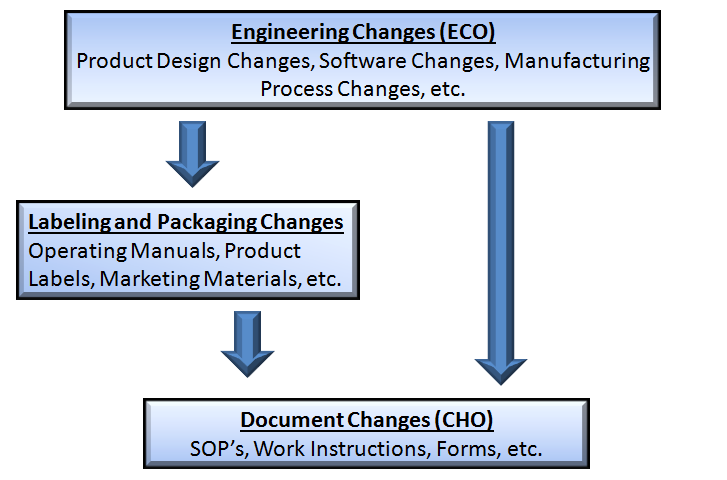

1.  **Purpose**

> This document defines the policies and procedures for controlling and
> maintaining the labeling associated with distributed products. These
> policies and procedures include labeling review and approval and
> labeling first article inspection.

1.  **Scope**

> This procedure applies to all labeling that is required by the Quality
> Management System and applicable regulatory requirements. Labeling
> includes product labels, package inserts, packaging graphics,
> marketing materials, and other material related to identification,
> technical description, and use of the device as defined below.
> Engineering changes to packaging that do not impact labeling are
> exempt from this procedure.

1.  **General**

    1.  **Definitions**

        -   **Label** – A display of written, printed, or graphic matter
            > upon the immediate container of any article.

        -   **Labeling** – Any written, printed, or graphic matter
            > affixed to or accompanying the medical device or any of
            > its containers/wrappers that are related to
            > identification, technical description, and use of the
            > device; labeling excludes shipping documents.

        -   **Final Proof** – The production master or first article
            > sample for a new or revised labeling/packaging item.

    2.  **Responsibilities**

> **Quality Management** – Quality Management is responsible for the
> implementation and continued compliance with the procedures specified
> in this document and by the regulatory authorities.

1.  **Equipment and Materials** – N/A

2.  **Safety Precautions** – N/A

3.  **Training Requirements** – All personnel responsible for the
    > approval of labeling shall be competent in relevant areas.

4.  **Record Management** – Labeling records are managed and maintained
    > by the Quality Department.

5.  **Reference Documents and Materials**

> **21 CFR 820** FDA Quality System Regulations
>
> **SOR/98-282** – Canadian Medical Device Regulations
>
> **MDR 2017/745** – EU Medical Device Regulation
>
> **MDD 93/42/EEC** – EU Medical Device Directive
>
> **ISO 13485** – Medical Device Quality Management Systems
>
> **FDA Guidance** – Labeling: Regulatory Requirements for Medical
> Devices
>
> **FDA Guidance** – Deciding When to Submit a 510(k) for a Change to an
> Existing Device
>
> **GHFT/SG1/N70** – Label and Instructions for Use for Medical Devices
>
> **QF-0006-1** – Labeling Review and Approval Form

1.  **Procedure**

> The company utilizes the following procedures to ensure labeling
> achieves the required objectives, is manufactured correctly, and meets
> all quality, regulatory, and customer/user requirements. All labeling
> documentation is required to be approved and archived within the
> Document Control Library. Examples of labeling documentation, if
> applicable, may include: Artwork, Proofs, Material Specifications,
> Label Index, Label First Articles, and Labeling Review and Approval
> Forms.
>
> All labeling associated with a product will be documented and
> controlled within the associated Device Master Record (DMR). The
> primary identification label and labeling used for each production
> unit shall be maintained with the Device History Record (DHR).

1.  **Label Content**

> The following information is required to be presented in a legible,
> permanent, and prominent manner on the product labeling. The
> Indications for Use, Directions for Use, and special storage
> conditions may accompany the product (e.g. IFU) if there is
> insufficient space on the outer package label. Specific requirements
> may be imposed by regulatory authorities based upon product risk
> and/or specific product types.

-   The name of the device

-   The name and address of the manufacturer

-   the identifier of the device, including the identifier of any
    > medical device that is part of a system, test kit, medical device
    > group, medical device family or medical device group family;

-   The contents of the package, expressed in terms appropriate to the
    > device

-   The word “Sterile”, device to be sold in a sterile condition;

-   The expiration date of the device, if applicable

-   Indication for Use: unless self-evident, provides the medical
    > conditions, purposes and function of the device, including the
    > performance specifications

-   Directions for Use: full information as to the procedure recommended
    > for achieving the optimum performance of the device, including
    > cautions, warnings, contraindications and possible side effects

-   Any special storage conditions applicable to the device.

    1.  **Label Translations**

> Labels may require translation based upon international distribution.
> Labeling items containing foreign languages require Certifications of
> Translation. These certifications shall be circulated during the
> review and approval process. A list of labeling translations and
> approved regulatory jurisdiction is maintained with the Device Master
> Record (DMR)

1.  **Labeling Change Control**

> The labeling review and approval process is documented on the Labeling
> Review and Approval Form. All new labeling and labeling modifications
> require a completed and approved form prior to implementation. When
> submitting labeling for review, the party responsible for initiating
> the changes shall provide each reviewer with a properly filled out
> approval form and associated documentation including clear
> identification and rationale for all changes. If applicable, proofs
> provided by the vendor shall be submitted along with the form.
> Completed approval forms and attachments are stored and maintained by
> the Quality Department.
>
> For all labeling changes that impact documents with the Document
> Control Library, the initiating party is responsible for ensuring
> updates are completed.

1.  **Labeling Information**

> Section 1 of QF-0004-1 provides background information regarding the
> proposed submission or changes and any documentation that will be
> impacted by the change. This section shall be completed prior to
> submitting to reviewers for approval.
>
> **4.1.2 Review and Approval Process**
>
> The approval process is documented in Section 2 of the Labeling and
> Approval Form. The appropriate parties shall review the changes
> relative to their area of expertise and items to be considered.
> Approval is designated by a signature and date.
>
> External reviews may be required for labeling that is managed by
> external vendors or requires approval by a customer, partner, or
> external party prior to use.
>
> **4.1.3 Reconciliation of Labels**
>
> For labeling changes that render the previous versions invalid, a
> labeling reconciliation shall be completed to ensure the appropriate
> disposition of the previous version of labeling. Label reconciliation
> documentation shall be stored and maintained by the Quality
> Department.

1.  **Labeling First Article Inspection**

> When the first production lot of updated labeling is received, the
> labeling shall be inspected against approved specifications/drawings
> and verified to be correct. Verification documentation along with
> first lot samples, where possible, shall be submitted to the Quality
> Department to be maintained along with the associated QF-0004-1. Where
> physical samples cannot be submitted along for approval, photographs
> or electronic files shall be acceptable.
>
> Products containing new or updated labeling shall not be released for
> distribution until the labeling first article inspection has been
> completed.

1.  **Revision History**

| **Rev \#** | **Doc \#** | **Effective Date** | **CHO** | **Description of Change**                                            |
|------------|------------|--------------------|---------|----------------------------------------------------------------------|
| 01         | QP-0006    |                    |         | Initial Implementation of the Labeling and Packaging Control Process |

1.  **Appendix
    A**
