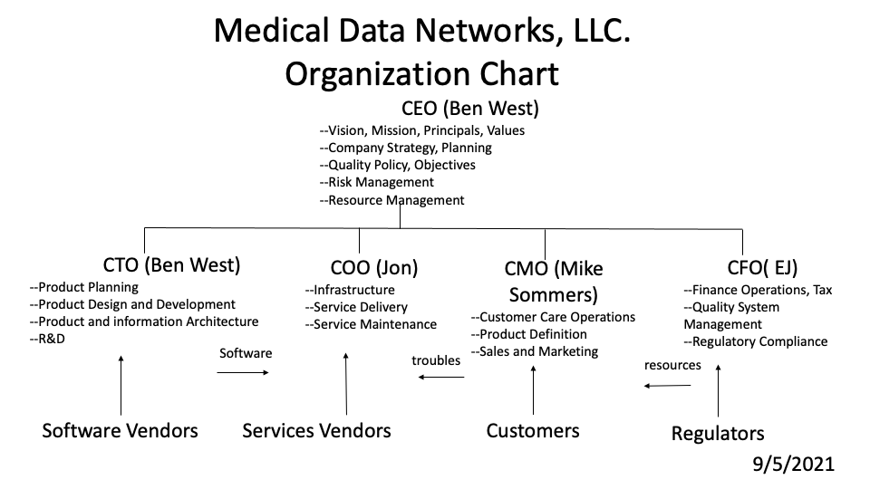

```{toctree}
```

**Medical Data Networks Quality Manual**

Document Number|Title|Effective|Owner
---------------|-------------------------------------|---------|--------
[QM-0001](./QM-0001_Quality_Manual.md)        |Quality Manual                       |9/16/2021|/s/ Ben West

**Approvals**

Approving Signature|Name|Role|Date
-------------------|----|----|---
/s/ Ben West       |Ben West|CEO|9/15/2021

# Introduction

## Purpose

This document provides a complete overview of the Quality Management System (QMS) used by Medical Data Networks LLC. to deliver operating "T1Pal"and "CoPilot" software applications
that run "ïn the cloud."

Because these are entirely operating software applications, we rely on the FDA's characterization of these kinds of things
as "devices" for which numerous regulations apply.

[FDA Rules](https://www.fda.gov/medical-devices/classify-your-medical-device/class-i-ii-exemptions)
say that all medical devices are subject to the Quality System Regulation (21 CFR 820),
also referred to as the
“Current Good Manufacturing Practices” or “Good Manufacturing Practices,”
unless there is an exception or exemption noted in 21 CFR 820.

This Quality Management System is fully intended to comply with the following domestic and international regulations and standards:

* Code of Federal Regulations (CFR), Title 21, Food and Drug
* 21 CFR Part 820 – Quality System Regulation
* ISO 13485 – Medical Devices – Quality Management Systems
* EU Medical Device Regulation – MDR 2017/745
* EU Medical Device Directive – MDD 93/42/EEC
* Other regulatory authorities as appropriate

The contents of a coherent set of files that contain
baselined procedures, templates, and operating records
are strictly managed by change-control procedures, and make this QMS work.

This QMS is made of these types of files.

1. Files describing procedures that shall be used by the QMS (QP prefix).
2. Files containing templates used by procedures (QF prefix)
3. Files Containing filled-in templates (i.e. operational records) (QR-prefix)

All of these marked down files are managed in a collection of files and folders hosted
on this github repository: [github.com:ehwest/mdn-qms](https://github.com:ehwest/mdn-qms).
This mark-down form of the QMS source enables a variety of rendered formats that
contain the same content.

The authoritative source of all QMS information is in this document 
is found here:  [QM-0001](QM-0001_Quality_Manual.md).

This [Quality Manual](./QM-0001_Quality_Manual.md) provides links to other files in the folder and provides
an overview of all of the files within the MDN QMS.
With the same Quality_Manual folder, we store the process descriptions for each of
30 distinct Quality Procedures.

In a separate "Quality_Manual_Forms" folder, one may find blank templates for capturing Quality Process records.
In yet another "Quality_Manual_Records" folder, Quality Records are kept (unless otherwise specified.

Here is a list of all of the Quality System procedures together with a link to the .md content file.

* [QP-0001_Quality_Manual -- Processes In Scope *(this document)* ](./QM-0001_Quality_Manual.md)
  *  [QP-0002_Design_Control_Process](./QP-0002_Design_Control_Process.md)
  *  [QP-0003_Document_Control_Process](./QP-0003_Document_Control_Process.md)
  *  [QP-0004_Training_and_Competency_Process](./QP-0004_Training_and_Competency_Process.md)
  *  [QP-0005_Purchasing_and_Receiving_Process](./QP-0005_Purchasing_and_Receiving_Process.md)
  *  [QP-0006_Labeling_and_Packaging_Control_Process](./QP-0006_Labeling_and_Packaging_Control_Process.md)
  *  [QP-0007_Identification_and_Traceability_Process](./QP-0007_Identification_and_Traceability_Process.md)
  *  [QP-0008_Nonconforming_Product_Procesa](./QP-0008_Nonconforming_Product_Process.md)
  *  [QP-0009_Change_Control_Process](./QP-0009_Change_Control_Process.md)
  *  [QP-0010_Software_Validation_Process](./QP-0010_Software_Validation_Process.md)
  *  [QP-0011_Customer_Complaint_Handling_Procedure](./QP-0011_Customer_Complaint_Handling_Procedure.md)
  *  [QP-0012_Corrective_and_Preventive_Action_CAPA_Process](./QP-0012_Corrective_and_Preventive_Action_CAPA_Process.md)
  *  [QP-0013_Management_Review_and_Data_Analysis_Process](./QP-0013_Management_Review_and_Data_Analysis_Process.md)
  *  [QP-0014_Calibration_and_Preventive_Maintenance_Process](./QP-0014_Calibration_and_Preventive_Maintenance_Process.md)
  *  [QP-0015_Quality_Audit_Process](./QP-0015_Quality_Audit_Process.md)
  *  [QP-0016_Preservation_of_Product_Process](./QP-0016_Preservation_of_Product_Process.md)
  *  [QP-0017_Risk_Management_Process](./QP-0017_Risk_Management_Process.md)
  *  [QP-0018_Record_Management_Process](./QP-0018_Record_Management_Process.md)
  *  [QP-0019_Customer_Property_Control_Process](./QP-0019_Customer_Property_Control_Process.md)
  *  [QP-0020_FDA_Audit_Management_Process](./QP-0020_FDA_Audit_Management_Process.md)
  *  [QP-0021_Medical_Device_Reporting_and_Recall_Process](./QP-0021_Medical_Device_Reporting_and_Recall_Process.md)
  *  [QP-0022_Infrastructure_and_Work_Environment](./QP-0022_Infrastructure_and_Work_Environment.md)
  *  [QP-0023_Supplier_Management_Process](./QP-0023_Supplier_Management_Process.md)
  *  [QP-0024_Post_Market_Surveillance_Process](./QP-0024_Post_Market_Surveillance_Process.md)
  *  [QP-0025_Unique_Device_Identification_Process](./QP-0025_Unique_Device_Identification_Process.md)
  *  [QP-0026_Process_Validation_Procedure](./QP-0026_Process_Validation_Procedure.md)
  *  [QP-0027_Technical_File_Process](./QP-0027_Technical_File_Process.md)
  *  [QP-0028_European_Union_Medical_Device_Directive_Procedure](./QP-0028_European_Union_Medical_Device_Directive_Procedure.md)
  *  [QP-0029_European_Union_Medical_Device_Regulation_Procedure](./QP-0029_European_Union_Medical_Device_Regulation_Procedure.md)
  *  [QP-0030_Canadian_Medical_Device_Regulations_Procedure](./QP-0030_Canadian_Medical_Device_Regulations_Procedure.md)

* [QF-0001 Quality_Manual_Forms_and_Templates](./Quality_Manual_Forms/README.md)

  * [QF-0002 Design_Control Records](./Design_Control/README.md)
  * [QF-0004 Training_and_Competency_Records](./Training_and_Competency_Records/README.md)
  * [QF-0005 Purchasing_Controls](./Purchasing_Controls/README.me)
  * [QF-0007 Traceability_Records](./Traceability_Records/README.md)
  * [QF-0008 Non_conforming_Product](./Non-conforming_Product/README.md)
  * [QF-0011 Customer_Complaints](Customer_Complaints/README.md)
  * [QF-0012 Corrective_and_Preventive_Action](Corrective_and_Preventive_Action/README.md)
  * [QF-0013 Management_Review](./Management_Review/README.md)
  * [QF-0014 Calibration_and_Preventive_Maintenance](./Calibration_and_Preventive_Maintenance/README.md)
  * [QF-0015 Internal_Audits](./Internal_Audits/README.md)
  * [QF-0021 Medical_Device_Reporting_and_Recalls](./Medical_Device_Reporting_and_Recalls/README.md)
  * [QF-0023 Supplier_Qualification_Records](./Supplier_Qualification_Records/README.md)
  * [QF-0024 Post-Market_Surveillance](./Post-Market_Surveillance/README.md)


* [QBF-0001 Other_Businessl_Forms_and_Templates](./Quality_Manual_Forms/README.md)
  * [QBF-0002 Customer_Fulfillment](./Customer_Fulfillment/README.md)
  * [QBF-0003 Engineering-Change_Orders](Engineering-Change_Orders/README/md)

## Scope

The Quality Management Systems defined in this manual applies to 
providing "T1Pal"and "CoPilot" cloud-based applications to subscribers, specifically
including the following activities.

* Product Design
* Product Development 
* Network Operations
* Customer Care

By "cloud based" we mean that subscribers are enabled to receive
the benefits of certain operating software applications, but do not maintain, carry, own, or lease  any
particular part of any server, and/or database system necessary to deliver features and functions
of the product.  

Subscribers are required to provide their own
internet (cloud) access arrangements to access the cloud based applications.

In the case of all MDN services,  the subscriber must provide their own  known-working on-line access to
the cloud devices by using a "browser" (or other  mobile application) having an ïnternet connection. The browser
and/or a mobile application
may be configured on any of several types of devices that "act like a modern browser."

In this context, for subscribers to access the "T1Pal"and/or the "CoPilot" features and benefits,
the subscriber must have a qualified device (having a known-compatible version).

This Quality Manual applies to the following facility where construction, testing, and distribution  of the 
(software) device is carried out.:

    Medical Data Networks, LLC.,  537 Montridge Ct., Franklin, TN  37067

The company has undertaken the following roles:

* ISO 13485 – Design, Manufacturer, Contract Manufacturer, Importer.

* US CFR 21 Part 820 – Specification Developer, Manufacturer, Contract Manufacturer, Importer, etc.

The following applicability **exclusions** apply:

* Sterilization Requirement and Processes (ISO Clause 7.5.5 & 7.5.7) – are not provided or distributed sterile products or utilize sterile processes.  

* Implantable Medical Devices (ISO Clause 7.5.9.2 & 8.2.6 Partial) – We do not provide or distribute implantable products.


## Responsibilities

The CEO and VP-level employees are responsible for overseeing and maintaining this QMS under QMS change-control procedures, and for assuring that all employees are trained in its applicable requirements.
## License

All documents that are part of the Medical Data Networks LLC repository are either licensed to Medical Data Networks LLC and/or are the private property of Medical Data Networks LLC.

All documents created or owned by Medical Data Network's employees are considered proprietary trade secrets and are not for disclosure outside of Medical Data Networks LLC, without specific written permission of an officer of Medical Data Networks LLC.

## Terms and Definitions

Term|Definition
----------------------------------|--------------------------------------------------------------
Appropriate Management|CEO, COO, President, Vice Presidents, Directors, Managers, Team Leaders.
Agile Product Development|A management process, where incrementally-defined demands and solutions are sequentially processed by cross-functional teams and their customers.  With this methodology the initial product is incrementally improved so as to deliver a "Minimum Viable Product (MVP)" having subsequent incremental improvements that are packaged as releases.
Continual improvement|Process of enhancing the Quality Management System to achieve improvements in overall quality, operations, and environmental performance in line with the organization’s Quality Policy.
Controlled Document|Any document that affects the quality of the product and is reviewed and approved prior to release for use or reference.
Corrective Action|A process improvement methodology aimed at identifying and eliminating the causes of known nonconformities and to prevent their recurrence.
Customer|The recipient of a product or service provided by the organization.
Design History File (DHF)|A compilation of records that describes the design history of the finished device.
Device History Record (DHR)|A compilation of records containing the production history of a finished device.
Device Master Record (DMR)|A compilation of records containing the procedures and specifications for a finished device.
Management with Executive Responsibility|Those senior employees who have the authority to establish or make changes to the organization’s quality policy and quality system.
Minimum Viable Product (MVP)|A product version that may be developed and delivered to customers having the least overall cost (and time-to-market) that also acceptably/minimally meets all of the most important customer requirements.
Preventive Action|A process improvement methodology aimed at identifying and eliminating potential causes of nonconformities before they occur.
Process|A set of interrelated resources and activities that transform inputs into outputs.
Process Leader|Person with primary process responsibility to document and maintain its procedures, work instructions, and forms; to control records; and to train process users.   Selected by management based upon primary job responsibilities.
Product|The result of activities or processes.
Proposal|Offer or quote made by an organization in response to a request for a quote to provide product.
Quality Policy|Statement by the organization of its intentions and principles in relation to its overall quality performance which provides a framework for action and for setting the organization’s quality objectives and targets.
Supplier or Vendor|The organization that provides a product or service to an organization.

# Quality System Requirements

## Product Definition, Design, Development, and Validation.

This QMS includes "Product Definition", "Product Design", "Development", and "Validation"."
sections as needed to convey how cloud-based operating software services (FDA "devices")  "T1Pal" and "CoPilot" are created, delivered, and validated consistent with applicable rules.

## Alignment With Rules

The present Quality Management System (QMS) is specifically designed to achieve and sustain the alignment of MDN 
services and/or software "devices" to applicable rules.
The applicable rules are:

1. Registration of T1Pal and CoPilot with the FDA
2. Meet FDA-defined "Special Controls" for T1Pal and CoPilot Operations
3. Support "Appropriate Validations" for T1Pal and CoPilot as "devices".
4. Implement certain "Special Controls" needed to sustain T1Pal Operations.

In this environment, **"Special Controls"** has been defined by the FDA as follows:

    A. Devices must protect against unauthorized access to and modification of data.

    B. Device labeling must display the following warnings and limitations: 

        1.  **Dosing decisions should not be made based on this device.**
  
        2.  **The user should follow instructions on the continuous glucose monitoring system.**
  
        3.  **This device is not intended to replace self-monitoring practices advised by a physician.**

## Change Control

The change control mechanism built into the QMS system, particularly the
github repository service, enables all users of the Quality Management System data procesing tools to determine whether or not they have an exact copy of all of the applicable documents. 
It also enables convenient read-only access to all incremental changes to any file that is part of the Quality Management System electronic record set. 
This ensures compliance with FDA Part 11 regulations for audit trail capabilities.


Each and every one of the Quality System folder names and the files within each such folder, and their links to other specific QMS folders within the Quality Management System repository,  altogether completely describe the Medical Data Networks LLC Quality Management System.  

The integrity and traceability of all changes to the Quality Management system is maintained in a "git" repository having its document root located here:  https://github.com/ehwest/mdn_qms. It should be noted that the "master" branch of this repository is the current operational repository of the QMS.  Other branches may be used to draft and test changes to the QMS, but are not further described within the QMS.

As such, all documents and artifacts that are part of the Quality Management System are subject to change-control procedures such that each and every change to the Quality Management System documentation is tracked by explicit versioning enforced by the git repository system.


It is the responsibility of all employees, contractors and departments at Medical Data Networks to adhere to this QMS.

The Medical Data Networks, LLC quality system has been established, documented, implemented, and maintained to ensure the products and services produced meet the quality standards of the organization and are in compliance with relevant regulatory bodies.  Our organization has applied a risk based approach to the control of the appropriate processes needed for the Quality Management Sytstem (QMS).

The Quality Management System is defined through a four level hierarchy:

* **Quality Manual:** _(This document is the Quality Manual)_ A First-level document that provides a general overview of the Quality System and defines the Quality Policy. 

* **Quality Policies and Procedures:** Second-level documents that provide more detailed explanation of the Quality System clauses and detail the structure of the Quality System.  A collection of pointers to Quality Procedures is provided in Appendix (chapter 3).

* **Standard Operating Procedures and Work Instructions** (sometimes referred to as  "Run Books"): Third-level documents that provide step-by-step instructions on how activities are to be carried out and the requirements of products produced.  These detailed documents are maintained separately on the Quality Management change control system, a git repository.
Each of the Quality Management system process descriptions points to one or more "Run Books" in the git repository.

* **Forms and Records:** Fourth-level documents or data that contain the information, charts, checklists, or other form of records as evidence to demonstrate conformance to specified requirements and the effective operation of the Quality System.
The Quality System Process documents point to folders that contain both templates and records of Quality System events.

If a particular development project or customer request cannot be fulfilled by the existing procedures, quality plans are created to ensure that the specific requirements are met.  Quality plans are consistent with all other requirements of the Quality System.  Consideration shall be given to the resources or skills required to meet specified requirements whenever there is a significant change to an existing product, process, test, inspection, verification, and measurement.
	
The following key processes and interactions define the organizational structure and responsibilities of the Quality Management System.  

```{eval-rst}
.. figure:: ./media/OrganizationChart.png
  :width: 100%
  :name: Organization Chart
  :caption:

```



These quality system processes are managed in accordance with the requirements of ISO 13485 and applicable regulatory requirements.  Changes to be made to these processes shall be:

* Evaluated for their impact on the quality management system

* Evaluated for their impact on the medical devices produce under this QMS

* Controlled in accordance with the requirements of ISO 13485 and applicable regulatory requirements.

For all outsourced processes that may affect conformance to requirements, the company ensures control over these processes through supplier assessment, purchasing and receiving processes, and/or documented procedures as applicable.  The company maintains responsibility of conformity to applicable international standards and regulatory requirements.  The controls shall be proportionate the risk involved and the ability of the external party to meet the in requirements and include a written quality agreement.

The company has documented procedures for the validation of the application of computer software used in the QMS.  Such software is validated prior to initial use and, as appropriate, after change to the software or its applications.  The specific approach and associated activities shall be proportionate to the risk associated with the use of the software.  Records of such activities are maintained.

# The Quality Management System Structure

The responsibility to develop and effectively implement quality system procedures is held by the designated owner for each quality procedure as determined by management.  Procedure details depend upon the complexity of the work, methods used, and the skills and training needed by personnel to carry out the activity. 

The Quality Management System includes:

* Quality Manual *(this document)*

* Documented Quality Policy and Objectives

* Documented procedures and records required by domestic and international regulations

* Documents, including records, determined by the organization as necessary to ensure quality

* Other documentation specified by applicable regulatory requirements

All management affected by the controlled documents are responsible to ensure that their personnel are adequately informed and trained, as necessary, to ensure the proper implementation of the procedures. Procedures and records may be created and/or maintained in the form of paper copy, electronic copy, or in other media as deemed appropriate.

The company has established and maintains this document as the Quality Manual. It includes:

* The scope of the quality management system.
* Description and/or definition of procedures established for the quality management system.
* A description of the interactions between the processes of the quality management system.

## Control of Documents

The company has established and maintains procedures to control all documentation and data related to the requirements of the applicable regulatory standards, including external documents, such as standard and electronic media.  These procedures define the controls for:

* A review and approval process to ensure adequacy and efficacy of documents

* A review process to ensure document content is accurate and updated

* Clear identification and justification of changes

* Ensuring the availability, readability, and accessibility of current documents

* Ensuring documents of external origin, determined necessary, are identified and controlled

* The prevention of deterioration or loss of documents

* The prevention of inadvertent use of obsolete documentation

## Control of Records 

It is the responsibility of all personnel to keep records of all work or operations performed in the format prescribed by the various policies and procedures in the quality system.  All records shall contain the date of creation and the person responsible for their creation.  All records shall be made in a permanent and legible manner and changes to a record shall remain identifiable.  Controls necessary for the identification, storage, protection, retrieval, retention time, and disposition of records shall be included within the documented procedure requiring the record.  Methods for protecting confidential health information contained in records shall be defined and implemented. 


## Management Responsibilities

### Management Commitment

Management is responsible for establishing a custodian of all quality records, including internal audits, management reviews, corrective actions, preventive actions, training records, proficiency test results, and other related records.  The record retention time is specified by relevant regulatory requirements or documented procedures, whether hard copy or electronic.  

Management demonstrates its commitment to the development and implementation of the Quality Management System, and its continual improvement, by:

* Communicating to the organization the importance of complying with customer, regulatory, and statutory requirements as applicable

* Establishing and communicating the Quality Policy

* Establishing, communicating, and enforcing Quality Objectives

* Conducting management reviews

* Providing necessary resources

### Customer Focus

Company Management ensures that customer requirements and applicable regulatory requirements (needs and expectations) are understood and are met with the aim of enhancing customer satisfaction.  These are generally established within product requirements and specifications and within quality management system documentation.

### Quality Policy

The *Quality Policy* is established by management with executive responsibility.  The company quality policy is stated below and is communicated throughout the organization to ensure commitment to quality within the organization.  The quality policy provides a framework for establishing and reviewing quality objectives and is reviewed periodically for continued effectiveness.


**Every employee accepts responsibility for the quality of our processes and medical devices.** 

This is achieved by continuously improving designs, implementing efficient procedures, and partnering with suppliers to meet or exceed the expectations of our customers, and satisfy the requirements of our quality system and appropriate regulations.

## Device Master Records (DMR)

For each medical device type or medical device family, we have established and maintain one or more files containing or referencing documents generated to demonstrate conformity to the requirement of ISO 13485 and applicable regulatory requirements.  The content of the file(s) includes:

* General description of the medical device, intended use/purpose, and labeling, including any instructions for use

* Specifications for the product

* Specifications or procedure for manufacturing, packaging, storage, handling, and distribution

* Procedures for measuring and monitoring

# Quality Objectives and Planning

## Quality Objectives

The company has identified the following Quality Objectives.  These objectives will be reviewed and updated as necessary to meet company goals.

* Establish and maintain a team-oriented working environment in which each employee accepts responsibility for the development, production, and delivery of high quality goods and services.

* Implement and maintain a Quality System compliant with the Quality System Requirements of the United States Food and Drug Administration (FDA), ISO 13485, European Union, and any other applicable regulatory requirements.

* Implement and maintain efficient quality systems and procedures that effectively control the quality of the products and services provided and emphasize continuous improvement.

* Define and monitor metrics of effectiveness for key elements of the business and utilize the data to effectively manage and drive improvement with emphasis on Customers, Products, Services, and Stakeholders.


## Quality Management System Planning

Management ensures that the planning of the Quality Management System is implemented by appropriate management and carried out by all employees in order to meet the requirements provided in this manual. Management also ensures the integrity of the Quality Management System is maintained when changes to the Quality Management System are planned and implemented.  

## Responsibility and Authority

Management has defined and documented the responsibility, authority, and interrelation of personnel who manage, perform, and verify work within the Quality Management System.  These responsibilities are documented in official job descriptions, which define the tasks performed by employees, and an organization chart depicting the interrelation of all employees.

All employees accept responsibility for the maintenance and improvement of the Quality Management System.  

This is achieved by understanding and supporting the Quality Policy and the appropriate clauses of the quality system for their areas of work; 
dedicating efforts to the continuous improvement, understanding how their activities impact quality, elimination and prevention of quality deficiencies; 
and initiating action to prevent the occurrence of nonconformities related to product and processes.

## Management Representation

The Management Representative is appointed by management with executive responsibility and is responsible and fully authorized to manage the Quality Management System and related matters on an ongoing basis.  Roles and responsibilities of the Management Representative include the following:

* Ensures that the Quality Management System is established, implemented, and maintained in accordance with applicable regulatory requirements.

* Interprets applicable standards and continually verifies compliance.

* Advises management regarding operation and performance of the quality systems and opportunities for improvement.

* Serves as liaison to external parties regarding matters relating to the QMS.

* Ensures the promotion of awareness of applicable regulatory, quality management, and customer requirements throughout the organization.

## Internal Communications

The Management Representative has the responsibility to work with other departments to ensure that adequate internal communication exists concerning the effectiveness and implementation of the Quality Management System.

Methods for internal communication include:

* Meetings

* Memos

* E-mails

* Formal Training

## Management Review

Management acknowledges responsibility for the quality systems and reviews the systems to ensure continuous suitability and effectiveness in relation to domestic and international regulatory requirement, this Quality Manual, and company objectives.  Management representing each key functional area participates in this review that includes assessing opportunities for improvement and the need to change the Quality Management System, including the Quality Policy and Objectives.  Records of management reviews are maintained.

###  Review Input

The activities reviewed during management reviews may include, but are not limited to:

* Feedback
* Customer complaint handling and trending
* Reporting to regulatory authorities
* Internal or third-party audits
* Monitoring and measurement of processes and products
* Corrective and preventive actions
* Previous management review activities
* Changes that could affect the Quality Management System
* New or revised regulatory requirements

### Review Output

The output from management review meetings may include decisions and actions relating to:

* Improvement needed to maintain the suitability, adequacy, and effectiveness of the Quality Management System and its procedures
* Improvement of the product, services, training, infrastructure, work environment, and other processes
* Changes needed to respond to applicable new or revised regulatory requirements
* Resource requirements and allocation

## Resource Management

### Provision of Resources

Management has the responsibility and authority to ensure there are adequate resources to support the Quality System throughout their functional areas of responsibility.  Each member of management is to provide adequate resources to:

* Implement and maintain the Quality Management System and continually improve its effectiveness
* Enhance customer satisfaction by meeting customer requirements
* Meet regulatory requirements
* Place trained and competent personnel in the right place at the right time to ensure company goals and objectives are met


### Human Resources

Resource and training requirement are identified and addressed on a regular basis in order to support the growth and changing needs of the company.  For each job function, management provides sufficient personnel with appropriate background, education, and experience.

The company has established and maintains documented procedures for establishing competence, providing needed training, and ensuring awareness of personnel.  These procedures include:

* Determining the necessary competence of personnel performing work affecting quality
* Providing training or other actions to achieve or maintain the necessary competence
* Evaluation of the effectiveness of the training and other actions taken.  The methodology for effectiveness check is proportionate to the risk associated
* Ensuring that personnel are aware of the importance of their activities and how they contribute to the achievement of quality objectives
* Maintaining appropriate records of education, training, skills, and experience.

### Infrastructure

Management maintains responsibility for infrastructure needed to produce quality products and services and documented the requirements for the work environment needed to achieve conformity to product requirements, prevent product mix-up, and ensure orderly handling product.  Infrastructure includes:

* Buildings, workspace, and associated utilities

* Process equipment (both hardware and software) 

* Supporting services (i.e. transport, communication, or information systems)

This infrastructure is reviewed and adjusted as needed to achieve company objectives.  

A documented procedure shall be established for any infrastructure maintenance activities, including interval of performing the maintenance activities when required, necessary to maintain quality and records of such activities shall be maintained. As appropriate, the requirements shall apply to equipment used in production the control of work environment, and monitoring and measurement.

### Work Environment and Contamination Control

The company maintains responsibility and has documented the requirements for the work environment to assure its suitability for achieving conformity to product requirements.

Where appropriate to ensure quality and compliance with applicable Environmental, Health, and Safety (EHS) requirements, the company has established:

* Documented requirements for health, cleanliness and clothing of personnel if contact between such personnel and the product or work environment could affect medical device safety or performance
* Documented requirements for environmental conditions and instructions for monitoring and controlling these conditions
* Training for personnel working temporarily under special environmental conditions

###  Contamination Control

As appropriate, the organization has planned and documented arrangements for the control of contamination or potentially contaminated product in order to prevent contamination of the work environment, personnel, or product

# **Product Realization**

The quality planning requirements for individual development projects, related processes and supporting documentation are described in the procedures for each of several well-defined process, for example, the design control procedure, supplier qualification procedure and other process procedures.  The company has developed a documented risk management procedure and maintains records of risk management activities.


The quality planning process, when initiated, shall provide for the following:

* Identification and acquisition of necessary controls, equipment, fixtures, resources and skills needed to achieve business goals and objectives.

* Provision for procedures, work instructions, inspections, tests, etc. to ensure product is manufactured to customer expectations and requirements including infrastructure and work environment.

* Required verification, validation, monitoring, measurement, inspection, test, handling, storage, distribution, and traceability activities specific to the product together with the criteria for product acceptance.

* Records needed to provide evidence that the realization processes and resulting product meet requirements.

The company has established and maintains a process for identifying hazards associated with products and processes, estimating and evaluating the associated risks, controlling these risks and monitoring the effectiveness of the control including post-production information. Documented risk management activities are included throughout the product realization process, where appropriate.  Records arising from risk management are maintained in a risk management file.

## Customer-Related Processes

### Determination of Requirements Related to the Product

The determination of the requirements relating to the product includes:

* Requirements specified by the customer including delivery, service and support, and product performance
* Requirements not specified by the customer but necessary for intended use, where known
* Statutory and regulatory requirements relating to the product
* Any user training needed to ensure specified performance and safe use of the product
* Additional requirements determined by the organization

### Review of Requirements Related to the Product

Contracts, including purchase orders, are reviewed to ensure customer requirements and amendments are communicated in a controlled manner.  The contract review requires the appropriate review of each proposal, contract, or order to ensure that:

* Product requirements are defined and documented
* Contract or order requirements differing from those previously expressed are resolved
* Applicable regulatory requirements are met
* Any user training identified in accordance with 7.2.1 is available or planned to be available
* The organization has the ability to meet the defined requirements

Amendments to a contract or customer’s specification are handled and correctly transferred to the concerned functions within the company and confirmed with the customer.

All management affected by the controlled documents are responsible to
ensure that their personnel are adequately informed and trained, as
necessary, to ensure the proper implementation of the procedures.
Procedures and records may be created and/or maintained in the form of
paper copy, electronic copy, or in other media as deemed appropriate.

Records of contracts, contract reviews, proposals and contract amendments are maintained in the customer file.

## Customer Communication

The company plans and documents effective arrangements for communicating with customers in relation to:

* Product information
* Inquiries, contracts, and order handling, including amendments
* Customer feedback, including customer complaints, and customer satisfaction
* Advisory notices
We have documented procedures for communicating with regulatory authorities in accordance with applicable regulatory requirements

## Design and Development

Documented procedures shall be used to control and verify the development of new products to ensure that the specified requirements are met.  

All of the products of MDN are currently defined entirely by software. In addition,
all of the supporting integrated services, data structures, and infrastructure component services are also
defined by software, and managed using configuration files.

Supporting this all-software approach to developing products, an "agile" process that implements "continuous integration"  and "çontinuous delivery" has been established
for all products developed by MDN.  

It should be noted that the goal of the original product release was to deliver
a "Minimum Viable Product (MVP)" that represents a minimal set of features that all meet the customer expectations and requirements (including any regulatory requirements).

Following the delivery of the MVP, subsequent small (i.e. agile) releases would be expected to rapidly deliver new and improved capabilities (i.e. "as if" the process were continuous).

### Design and Development Inputs

Design input requirements relating to the product are identified, documented, and reviewed for adequacy.  Design input requirements include:

* Functional, performance, usability, and safety requirements, according to its intended use

* Applicable statutory and regulatory requirements and standards

* Applicable output(s) of risk management

* As appropriate, information derived from previous similar designs

* Other requirements essential for design and development of the product and processes

Design input requirements are reviewed for adequacy and incomplete, ambiguous, or conflicting requirements are resolved.  Requirements shall be complete, unambiguous, able to be verified or validated, and not in conflict with each other.

###  Design and Development Outputs

Design outputs are provided in a form suitable for verification against design input and are approved prior to release.  Design outputs:

* Demonstrate that input requirements have been met

* Provide appropriate information for purchasing and production

* Contain or reference product acceptance criteria

* Specify product characteristics essential for its safe and proper use

###  Design and Development Review

The design control procedure requires that systematic design and development reviews be conducted to:

* Evaluate the ability of the design to meet the requirements

* Provide for a review by participants representing concerned functions as well as other specialized personnel

* Identify any deficiencies and propose necessary actions 

Participants in these reviews include representative from relevant functional areas and specialist personnel, concerned with the design stage being reviewed.

Records of the results of design reviews and any necessary actions are maintained and include the identification of the design under review, the participants involved and the date of the review.

It is the responsibility of all personnel to keep records of all work
or operations performed in the format prescribed by the various
policies and procedures in the quality system. All records shall
contain the date of creation and the person responsible for their
creation. All records shall be made in a permanent and legible manner
and changes to a record shall remain identifiable. Controls necessary
for the identification, storage, protection, retrieval, retention
time, and disposition of records shall be included within the
documented procedure requiring the record. Methods for protecting
confidential health information contained in records shall be defined
and implemented.

Management is responsible for establishing a custodian of all quality
records, including internal audits, management reviews, corrective
actions, preventive actions, training records, proficiency test
results, and other related records. The record retention time is
specified by relevant regulatory requirements or documented
 procedures, whether hard copy or electronic.

###  Design and Development Verification

Design and development verification is performed in accordance with planned and documented arrangements to ensure that design outputs comply with design input requirements.
The company documents verification plans that include methods, acceptance criteria and, as appropriate, statistical techniques with rational for sample size.

If the intended use requires that the medical device be connected to, or have an interface with, other medical device(s), verification shall include confirmation that the design outputs meet design inputs when so connected or interfaced.

Management demonstrates its commitment to the development and
implementation of the Quality Management System, and its continual
improvement, by:

* Communicating to the organization the importance of complying with customer, regulatory, and statutory requirements as applicable

* Creating records of the results and conclusions of design verification and any necessary actions.

###  Design and Development Validation

Design validation is performed in accordance with planned and documented arrangements to ensure that the design is capable of meeting the requirements for the specified application or intended use, where known.  

The company documents validation plans that include methods, acceptance criteria and, as appropriate, statistical techniques with rationale for sample size.

As part of design and development validation, the organization shall perform clinical evaluation or performance evaluations of the medical device in accordance with applicable regulatory requirements.  A medical used for clinical evaluation or performance evaluation is not considered to be released for use to the customer.

If the intended use requirement that the medical device be connected to, or have an interface with, other medical device(s), validation shall include confirmation that the requirements for the specified application or intended use have been met when so connected or interfaced.

Validation will be performed prior to the release for use of the product to the customer

Records of the results and conclusions of design validation and any necessary actions are maintained.

###  Design and Development Transfer

Design transfer is performed in accordance with planned and documented arrangements to ensure the transfer of design and development outputs to manufacturing.  These procedures ensure that design and development outputs are verified as suitable for manufacturing before becoming final production specification and that production capability can meet production requirements.

Records and conclusions of the results of design validation and any necessary actions are maintained.

###  Control of Design and Development Changes

Design changes and modifications are identified, documented, reviewed, and approved by appropriate management prior to implementation.  The company determines the significance of the change to function, performance, usability, safety, and applicable regulatory requirements for the medical device and its intended use.

Design and development changes are identified and before implementation, the changes are reviewed, verified, validated (as appropriate), approved.

The review of design and development changes shall include evaluation of the effect of the changes on constituent parts and product in process or already delivered, inputs or outputs of risk management, and product realization processes.

The company has identified the following Quality Objectives. These
objectives will be reviewed and updated as necessary to meet company
goals.

-   Establish and maintain a team-oriented working environment in which
    each employee accepts responsibility for the development,
    production, and delivery of high quality goods and services.

-   Implement and maintain a Quality System compliant with the Quality
    System Requirements of the United States Food and Drug
    Administration (FDA), ISO 13485, European Union, and any other
    applicable regulatory requirements.

-   Implement and maintain efficient quality systems and procedures that
    effectively control the quality of the products and services
    provided and emphasize continuous improvement.

-   Define and monitor metrics of effectiveness for key elements of the
    business and utilize the data to effectively manage and drive
    improvement with emphasis on Customers, Products, Services, and
    Stakeholders.

###   Design and Development Files

The company maintains a design and development file for each medical device type or medical device family.  This file includes or references records generated to demonstrate conformity to the requirements for design and development and records for design and development changes.

# Measurement, Analysis, and Improvement 

The company plans and implements the monitoring, measurement, analysis, and improvement processes needed to:

* Demonstrate conformity of the product
* Ensure conformity of the Quality Management System
* Maintain and continually improve the effectiveness of the product
* Maintain and continually improve the effectiveness of the QMS

## Monitoring and Measuring

As one of the measurements of the effectiveness of the quality management system, the company gathers and monitors information relating to whether the organization has met customer requirements.  The methods for obtaining and using this information are documented.  This feedback process includes provisions to gather data from production as well as post-production activities.

The information gathered in the feedback process serves as potential input into risk management for monitoring and maintaining the product requirements as well as the product realization or improvement processes.

If applicable regulatory requirements require us to gain specific experience from post-production activities, the review of this experience shall form part of the feedback process.

## Complaint Handling

The company has implemented documented procedures for timely complaint handling in accordance with applicable regulatory requirements.

These procedures include at a minimum requirements and responsibilities for:

* Receiving and recording information
* Evaluating information to determine if the feedback constitutes a complaint
* Investigating Complaints
* Determining the need to report the information to the appropriate regulatory authorities
* Handling of complaint-related product
* Determining the need to initiate corrections or corrective actions


If any complaint is not investigated, justification shall be documented.  Any correction or corrective action resulting from the complaint handling process shall be documented.

If an investigation determines activities outside the organization contributed to the complaint, relevant information shall be exchanged between the organization and the external party involved.

Complaint handling records are maintained.

##  Reporting to Regulatory Authorities

If applicable regulatory requirements require notification of complaints that meet specified reporting criteria of adverse events or issuance of advisory notices, we have documented procedures for providing notification to the appropriate regulatory authorities.  Records of reporting to regulatory authorities are maintained.

##  Internal Audits

The company conducts internal audits at planned intervals to determine whether the quality management system:

The company has implemented a documented procedure to descript the responsibilities and requirements for planning and conducting audits and recording and reporting audit results.

The audit program is planned, taking into consideration the status and importance of the processes and area to be audited, as well as the results of previous audits.  The audit criteria, scope, interval, and methods are defined and recorded.

The selection of auditors and conduct of audits shall ensure objectivity and impartiality of the audit process.  Auditors do not audit their own work.

Records of the audits and their results, including identification of the processes and areas audited and the conclusions, are maintained.

The management responsible for the area being audited ensures that any necessary corrections and corrective actions are taken without undue delay to eliminate detected nonconformities and their causes.  Follow-up activities shall include the verification of the actions taken and the reporting of verification results. 

##  Monitoring and Measurement of Processes

Documented procedures shall define the methods used for controlling the manufacturing processes and make reference to any applicable instructions utilized to define how work is conducted.  Where required, these procedures are available at the workstation.

The effectiveness of these processes is evaluated based on their ability to produce products and/or services that are consistent with the Quality Policy and Quality Objectives.  They will be evaluated during management review meetings.

##  Monitoring and Measurement of Product

Product shall be inspected and/or tested in order to verify that the specified requirements for the product are met.  Required inspection and/or testing and the records to be established are detailed in the quality plan and/or documented procedures.  In-process inspection and testing are performed as required by documented procedure.

Company procedures ensure that in-process inspection and testing are carried out, and defines the criteria for holding of products until these inspection and tests activities have been completed and necessary reports have been documented.  All final testing is conducted in accordance with the quality plan or documented procedures to complete the evidence of conformance of the finished product to the specified requirements.

The quality plan or documented procedures require that:

* Product is held until all the required testing has been carried out and the results meet specified requirements
* Final inspection may include accumulation of in-process inspection results or specific final testing as appropriate
* Final inspection and testing includes the verification that all previous inspection and testing activities, including those specified at receipt of products or in-process, have been carried out with results meeting the specified requirements.

All inspection and testing is recorded and approved by the personnel performing the inspection and/or testing to provide evidence the product has been inspected and/or tested. The identity of the person authorizing release of product shall be recorded. 

* These records show clearly whether the product has passed or failed the inspections and/or tests according to defined acceptance criteria.
* As appropriate, these records identify the test equipment used to perform measurement activities.
* Traceability exists between the test records and the product tested.
* Where the product fails to pass any inspection and/or test, the procedure for control of nonconforming product shall apply.


# Control of Nonconforming Product

Product that does not conform to specified requirements shall be identified and controlled to prevent its unintended use or delivery.  The company has implemented a documented procedure to define the controls and related responsibilities and authorities for the identification, documentation, segregation, evaluation, and disposition of nonconforming product.  

The evaluation of nonconformity includes a determination of the need for an investigation and notification of any external party responsible for the nonconformity.  Records of the nature of the nonconformities and any subsequent action taken, including the evaluation, any investigation, and the rationale for decisions is maintained.

##  Actions in Response to Nonconforming Product Detected before Delivery

The company manages nonconforming product by one or more of the following ways:

* Taking action to eliminate the detected nonconformity
* Taking action to preclude its original intended use or application
* Authorizing it use, release, or acceptance under concession

The company ensures that nonconforming product is accepted by concession only if the justification is provided, approval is obtained, and applicable regulatory requirements are met.  Records of the acceptance by concession and the identity of the person authorizing the concession are maintained.

## Actions in Response to Nonconforming Product Detected after Delivery

When nonconforming product is detected after delivery or use has started, we take action appropriate to the effects, or potential effects, of the nonconformity.  Records of actions taking are maintained.

The company has documented procedures for issuing advisory notices in accordance with applicable regulatory requirements.  These procedures are capable of being put into effect at any time.  Records of actions relating to the issuance of advisory notices shall be maintained.

## Rework

The company completes rework in accordance with documented procedures that take into account the potential adverse effect of the rework on the product.  These procedures shall undergo the same review and approval as the original procedure.

After the completion of rework, product shall be verified to ensure that it meets applicable acceptance criteria and regulatory requirements.  Records of rework are maintained.

## Analysis of Data

Quality data are collected and analyzed to determine the effectiveness of the Quality Management system and to identify opportunities for improvement.  Data relating to customer satisfaction, product conformity to requirements, supplier performance, process performance and product trends used to determine corrective and preventive actions, are reviewed during management review meetings and documented in the minutes.  Trends in company level data are analyzed and compared to overall business goals and objectives.  Key product and service features are included in the analysis and if deficiencies are noted, action is taken to correct them to ensure customer satisfaction.

## Improvement

The company will identify and implement any changes necessary to ensure and maintain the continued suitability, adequacy, and effectiveness of the quality management system as well as medical device safety and performance through the use of the quality policy, quality objectives, audit results, post-market surveillance, analysis of date, corrective actions, preventive actions, and management review.

# Corrective Actions & Preventive Actions

The company has established and maintains documented procedures to implement corrective actions to eliminate the cause of nonconformities in order to prevent recurrence.  Any necessary corrective actions shall be taken without undue delay.  Corrective actions shall be proportionate to the effects of the nonconformities encountered.  

* Reviewing non-conformities (including complaints)
* Determining the cause of nonconformities
* Evaluating the need for action to ensure that nonconformities do not recur
* Planning and documenting action needed and implementing such action, including, as appropriate, updating documentation
* Verifying that the action does not adversely affect the ability to meet applicable regulatory requirements or the safety and performance of the medical device
* Reviewing the effectiveness of the preventive action taken, as appropriate

Records of the results of any investigation and of action taken are maintained.

The company has established and maintains documented procedures to implement preventive actions and eliminate the causes of potential nonconformities proportionate to the effects of the potential problems.  This documented procedure includes:
* Determining potential nonconformities and their causes
* Evaluating the need for action to prevent occurrence of nonconformities
* Planning and documenting action needed and implementing such action, including, as appropriate, updating documentation
* Verifying that the action does not adversely affect the ability to meet applicable regulatory requirements or the safety and performance of the medical device
* Reviewing the effectiveness of the preventive action taken, as appropriate

Records of the results of any investigations and of actions taken are maintained.


# Appendix: Regulatory Requirement Reference

This appendix enumerates applicable regulatory requirements and provides
a link for each to an applicable document in this Quality Management System.

**ISO 13485:2016** 

Management Subsystem|QMS Document
-------------------------------|-----------
Quality Management System/ Quality Manual / Quality Policy (4.1/4.2/5.3)|Quality Manual
Organizational Roles (4.1.1) * Quality Planning (5.4) |Quality Manual
Customer Focus/ Customer Satisfaction (5.2)|Quality Manual
Management Commitment/ Responsibility/ Authority/ Internal Communication (5.1/5.5)|Quality Manual
Provision of resources (6.1/6.2)|QP-0013
Management review/ Analysis of Data (5.6/8.4) |QP-0013

Documentation and Records Subsystem|QMS Document
-------------------------------|-----------
Approval of documents and changes (4.2.4)|QP-0003
Control of documents of external origin (4.2.4)|QP-0003
Device Master Records (4.2.3)|QP-0003
Approval of labelling incl. translation process (4.2.4)|QP-0003 / QP-0006
Document distribution and linkage to the training process (4.2.4)|QP-0003 / QP-0006
Document and Records retention (4.2.1/ 4.2.5)|QP-0018

Human Resources(Source)|QMS Document
-------------------------------|-----------
Competence evaluation and training (6.2/ 6.2)|QP-0004
Records of education, training, skills and experience (4.2.5)|QP-0004
Quality System, MDR (6.2)|QP-0004

Risk Management(Source)|QMS Document
-------------------------------|-----------
Risk Management (7.1/ MDR)|QP-0017

Purchasing Controls Subsystem|QMS Document
-------------------------------|-----------
Supplier evaluation and selection (7.4.1) |QP-0023
Supplier controls and monitoring (7.4.1)|QP-0023
Verification of purchased products- process (7.4.3)|QP-0005
Specifications (adequacy) for products and services (7.4.2)|QP-0005

Design and Development Subsystem|QMS Document
-------------------------------|-----------
Design and Development Planning (7.3.2)|QP-0002
Design and Development Inputs (7.3.3)|QP-0002
Design and Development Outputs (7.3.4)|QP-0002
Design and Development Review (7.3.5)|QP-0002
Design and Development Verification (7.3.6)|QP-0002
Design and Development Validation (7.3.7)|QP-0002
Design and Development Transfer (7.3.8)|QP-0002
Control of Design and Development Changes (7.3.9)|QP-0002 QP-0009
Design and Development Files (7.3.10)|QP-0002

Production & Process Controls Subsystem|QMS Document
-------------------------------|-----------
Process to control nonconforming products (8.3)|QP-0008
MRB- review, investigation and disposition of nonconforming products (8.3/8.5.2).|QP-0008
Nonconforming products in distribution- internal company vs. customer controlled (8.3/8.5.2)|QP-0008
Receiving Inspection (7.4.3, 8.3)|QP-0005
Requirements for products and materials|QP-QP-0005
Acceptance activities, status and records|QP-0005
Handling of materials (6.3, 7.5.11)|QP-0016
Warehousing (6.3/ 6.4)|QP-0022
Control of production (7.5.1)|"Run Books"
Product/ material identification and traceability (7.5.8)|QP-0007
Process control and monitoring (7.5)|QP-0013
monitoring and control of process parameters (8.2.5)|QP-0013
approval of processes and process equipment (7.5.6):|QP-00133
Handling of products (7.5.11) |QP-0016
In-process and finished device testing/acceptance status (7.5.8/ 8.2.6)|"Run Books"
Labeling and packaging operations (7.5.1)|QP-0006
Device History Records- review (4.2.4)|QP-0007
Handling of customer property (7.5.10) |QP-0019
Calibration System- monitoring and measuring equipment (7.6)|QP-0004
Preventive Maintenance program (6.3)|QP-0014
Equipment qualification/ validation and process validation incl. software validation (7.5.6)|QP-0026

Outsourcing / Planning of Product Realization|QMS Document
-------------------------------|-----------
Identification and control of Outsourced processes (4.1/ 7.4.1)|QP-0023
Notification of changes to Notified Body/ Health Canada (4.1, 7.2.1/ 7.3.7)|QP-0028 / QP-0029

Customer Related Processes|QMS Document
-------------------------------|-----------
Contract Review (7.2.1/7.2.2/7.2.3)|Run Books

CAPA Subsystem |QMS Document
-------------------------------|-----------
Experience from post-production phase/ Customer communication/ Feedback (7.2.3/8.2.1)|QP-0011
CAPA- corrective/ preventive actions, Distribution of Nonconforming Products (8.3/8.5.1-3)|QP-0012
EU Vigilance System incl. Advisory Notices (8.5.1)|QP-0011
Mandatory Problem Reporting/ Recall (8.5.1)|QP-0021
Analysis of data- Monitoring & Measurement of Processes/ Statistical Techniques (8.4/8.2.3)|QP-0013

Internal Audits & Improvement|QMS Document
-------------------------------|-----------
Audit program incl. ISO 13485, CMDR, MDR, other requirements (8.2.4) |QP-0015
Process, documentation, linkage to CAPA (8.2.4/8.5.2)|QP-0015


**FDA CFR 21 Part 820 – Quality System Regulation**

Subpart A – General Provisions

Requirement|Document ID
-----------|----------
Scope (820.1)|Quality Manual QM-0001
Definitions (820.3)|Quality Manual QM-0001
Quality System (820.5)|Quality Manual QM-0001

Subpart B – Quality System Requirements

Requirement|Document ID
-----------|----------
Management Responsibility (820.20)|QP-0013 / Quality Manual QM-0001
Quality Audit (820.22)|QP-0015
Personnel (820.25)|QP-0004

Subpart C – Design Controls

Requirement|Document ID
-----------|----------
Design Controls (820.30)|QP-0002

Subpart D – Document Controls

Requirement|Document ID
-----------|----------
Document Controls (820.40) |QP-0003

Subpart E – Purchasing Controls

Requirement|Document ID
-----------|----------
Purchasing Controls (820.50)|QP-0005

Subpart F – Identification and Traceability

Requirement|Document ID
-----------|----------
Identification (820.60)|QP-0007
Traceability (820.65)|QP-0007

Subpart G – Production and Process Controls

Requirement|Document ID
-----------|----------
Production and Process Controls (820.70)|Run Books
Inspection, Measuring, and Test Equipment (820.72)|QP-0014
Process Validation (820.75)|QP-0026

Subpart H – Acceptance Activities

Requirement|Document ID
-----------|----------
Receiving, In-Process, and Finished Device Acceptance (820.80)|QP-0005
Acceptance Status (820.86)|Run Books

Subpart I – Nonconforming Product

Requirement|Document ID
-----------|----------
Nonconforming Product (820.90)|QP-0008

Subpart J – Corrective and Preventive Action

Requirement|Document ID
-----------|----------
Corrective and Preventive Action (820.100)|QP-0012

Subpart K – Labeling and Packaging Control

Requirement|Document ID
-----------|----------
Device Labeling (820.120)|QP-0006
Device Packaging (820.130)|QP-0006

Subpart L – Handling, Storage, Distribution, and Installation

Requirement|Document ID
-----------|----------
Handling (820.140)|QP-0016
Storage (820.150)|QP-0016
Distribution (820.160)|Run Books
Installation (820.170)|Run Books

Subpart M – Records

Requirement|Document ID
-----------|----------
General Requirements (820.180)|QP-0018
Device Master Record (820.181)|DMRs
Device History Record (820.184)|QP-0007
Quality System Record (820.186)|QP-0018
Complaint Files (820.198)|QP-0011

Subpart N – Servicing

Requirement|Document ID
-----------|----------
Servicing (820.200)|Run Books & WI

Subpart O – Statistical Techniques

Requirement|Document ID
-----------|----------
Statistical Techniques|QP-0013


**FDA CFR 21 Other Applicable Regulations **

Part 11 – Electronic Records; Electronic Signatures

Requirement|Document ID
-----------|----------
General Provisions|Run Books
Electronic Records|Run Books
Electronic Signatures|Run Books

Part 801 – Labeling

Requirement|Document ID
-----------|----------
General Labeling Provisions|QP-0006
Labeling Requirements for Unique Device Identification|QP-0006
Labeling Requirements for Over-the-Counter Devices|QP-0006
Exemptions from Adequate Directions for Use|QP-0006
Special Requirements for Specific Devices|QP-0006

Part 803 – Medical Device Reporting

Requirement|Document ID
-----------|----------
General Provisions|QP-0021
Generally Applicable Requirements for Individual Adverse Event Reports|QP-0021
User Facility Reporting Requirements|QP-0021
Manufacturer Reporting Requirements|QP-0021

Part 830 – Unique Device Identification

Requirement|Document ID
-----------|----------
Requirement for a Unique Device Identifier|QP-0025
FDA Accreditation of an Issuing Agency|QP-0025
FDA as an Issuing Agency|QP-0025
Global Unique Device Identification Database|QP-0025

EU MDR Medical Device Regulation

Requirement|Document ID
-----------|----------
EU Authorized Representative|QP-0028
Safety and Performance Requirements (Annex I)|QP-0002 / QP-0027
Information supplied by manufacturer (Annex I)|QP-0006
Unique Device Identification (Article 27 & 28)|QP-0025
Information and notification of post-production incidents (Chapter VII)|QP-0010/QP-0024
Clinical Evaluation and Post Market Surveillance (Chapter 27)|QP-0024/QP-0027


Canadian Medical Device Regulations

Requirement|Document ID
-----------|----------
Review of Canadian Device Licenses/ Amendments  |QP-0029
Safety and Effectiveness Requirements|QP-0002
Labeling Requirements|QP-0006


# Appendix: Quality System Quick Access Facility

This appendix enumerates each of the Quality Procedures used to operate Medical Data Networks, LLC so as to deliver quality products that align with applicable rules and regulations.
The state of the approval for each such document is provided.

**Quality System Procedures**

| **Document ID**| **Procedure**  | **Record-Keeping Template(s)** | **Implementation Status** |
|----------------|----------------|-----------------|-------------|
|                |                                             |             |             |
|[QP-0001 R1](./README.md) (this document)|Quality Manual Update Process|N/A|Approved 9/1/2021|
|[QP-0002 R1](QP-0002_R1_Design_Control_Process.md)|Design Control Process|[QF-0002 Design_Control_Records](./Design_Control/README.md)| Approved 9/1/2021|
|[QP-0003 R1](./QP-0003_R1_Document_Control_Process.md)|Document Control Process|N/A| Approved 9/1/2021|
|[QP-0004 R1](./QP-0004_R1_Training_and_Competency_Process.md)|Training and Competency Process|[QF-0004 Training and Competency Records](./Training_and_Competency_Records/README.md)|Approved 9/1/2021|
|[QP-0005 R1](./QP-0005_R1_Purchasing_and_Receiving_Process.md)|Purchasing and Receiving Process |[QF-0005 Purchasing Controls](./Training_and_Competency_Records/README.md)|N/A|N/A|
|[QP-0006 R1](./QP-0006_R1_Labeling_and_Packaging_Control_Process.md)|Labeling and packaging Control|N/A|N/A|
|[QP-0007 R1](./QP-0007_R1_Identification_and_Traceability_Process.md)|[Traceability Records](./Traceability_Records/README.md)|Not defined yet |N/A
|[QP-0008 R1](./QP-0008_R1_Nonconforming_Product_Process.md)|Nonconforming Product process|[QF-0008 Non Conforming Product](./Non_conforming_Product.md)|Not defined yet|
|[QP-0009 R1](./QP-0009_R1_Change_Control_Process.md)| Change Control Process|N/A|Approved 9/1/2021|
|[QP-0010 R1](QP-0010_R1_Software_Validation_Process.md)| Software Validation Process|N/A|Approved 9/1/2021|
|[QP-0011 R1](./QP-0011_R1_Customer_Complaint_Handling_Procedure.md)| Customer Complaint Handling Procedure|[QF-0011 Customer Complaints](./Customer_Complaints/README.md)| Approved 9/1/2021|
|[QP-0012 R1](./QP-0012_R1_Corrective_and_Preventive_Action_CAPA_Process.md)|Corrective and Preventive Action|[QF-0012 CAPA Forms](./Corrective_and_Preventive_Action./README.md)|Approved 9/1/2021|
|[QP-0013 R1](./QP-0013_R1_Management_Review_and_Data_Analysis_Process.md)|Management Review and Data Analysis Process|[QF-0013 Management Review](./Management_Review/README.md)| Not defined yet|
|[QP-0014 R1](./QP-0014_R1_Calibration_and_Preventive_Maintenance_Process.md)|Calibration and Preventive Maintenance Process|[QF-0014 Calibration and Preventive Maintenance Process](./Calibration_and_Preventive_Maintenance/README.md)|Not defined yet|
|[QP-0015 R1](./QP-0015_R1_Quality_Audit_Process.md)|Quality Audit Process|[QF-0015 Internal Audit Records](./Internal_Audits/README.md)| Not defined yet           |
|[QP-0016 R1](./QP-0016_R1_Preservation_of_Product_Process.md)                 | Preservation of Product Process|N/A| Approved 9/1/2021         |
|[QP-0017 R1](./QP-0017_R1_Risk_Management_Process.md)| Risk Management Process|N/A| Approved 9/1/2021|
|[QP-0018 R1](./QP-0018_R1_Record_Management_Process.md)| Record Management Process| N/A| Approved 9/1/2021|
|[QP-0019 R1](./QP-0019_R1_Customer_Property_Control_Process.md)| Customer Property Control Process|N/A| Not defined yet|
|[QP-0020 R1](./QP-0020_R1_FDA_Audit_Management_Process.md)| FDA Audit Management Process|N/A|Not defined yet|
|[QP-0021 R1](./QP-0021_R1_Medical_Device_Reporting_and_Recall_Process.md)|Medical Device Reporting and Recall Process|[QF0021 Medical Device Reporting and Recall Records](./Medical_Device_Reporting_and_Recall/README.md)|Not defined yet|
|[QP-0022 R1](./QP-0022_R1_Infrastructure_and_Work_Environment.md)|Infrastructure and Work Environment|N/A|Not defined yet|
|[QP-0023 R1](./QP-0023_R1_Supplier_Management_Process.md)|Supplier Management Process|Not defined yet|
|[QP-0024 R1](./QP-0024_R1_Post_Market_Surveillance_Process.m)|Post Market Surveillance Process|[QF-0024 Post Market Surveillance](./Post-Market_Surveillance/README.md)| Not defined yet|
|[QP-0025 R1](./QP-0025_R1_Unique_Device_Identification_Process.md)|Unique Device Identification Process|| Not defined yet|
|[QP-0026 R1](./QP-0026_R1_Process_Validation_Procedure.md)|Process Validation Procedure|N/A| Not defined yet|
|[QP-0027 R1](./QP-0027_R1_Technical_File_Process.md)|Technical File Process|N/A| Not defined yet|
|[QP-0028 R1](QP-0028_R1_European_Union_Medical_Device_Directive_Procedure.md)| European Union Medical Device Directive Procedure|| Not defined yet|
|[QP-0029 R1](QP-0029_R1_European_Union_Medical_Device_Regulation_Procedure.md)| European_Union_Medical_Device_Regulation_Procedure|| Not defined yet|
|[QP-0030 R1](QP-0030_R1_Canadian_Medical_Device_Regulations_Procedure.md)| Canadian Medical Device Regulations Procedure|N/A | Not defined yet|


# Revision History

This Quality Manual is subject to change.

Major revisions are enumerated below.   
Because the git repository for all QMS documents is github and github provides by default the latest
official version,  version tracking is built into the system.
By downloading a copy of the Quality Manual and and/or any of the procedures, you are guaranteed to have the latest version.

REV #|Doc ID|Effective Date|Description of Change
-----|------|--------------|---------------------
01   | Quality Manual| 9/15/2021|Initial Release of the Quality Manual


