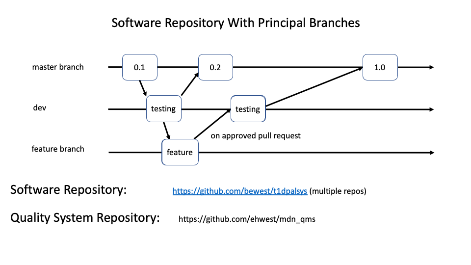
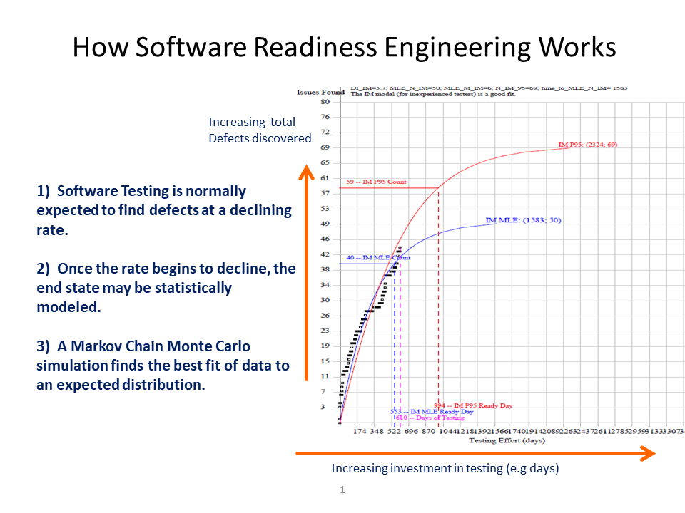

Document Number|Title|Revision|Effective|Owner
---------------|-------------------------------------|---|----|-----
QP-0010|Software Development and Validation Process|R 1|9/20/2021|/s/ Ben West

1.  **Purpose**

 This document defines the policies and procedures utilized for
 developing, verifying, and releasing software associated products. It
 defines an agile development process used and specifies the
 activities associated with software planning, requirement,
 architecture, detailed design, unit testing, integration and system
 testing, and release.

2.  **Scope**

 This process applies to all software incorporated into distributed
 medical devices. Any software systems not intended for
 commercialization or the quality management system are exempt from
 this process.

3.  **General**

3.1  **Definitions**

 **Software of Unknown Provenance (SOUP)** – Software item that is
 already development and generally available and that has not been
 developed for the purpose of being incorporated into the medical
 device (also known as “off-the-shelf software”) or software previously
 development for which adequate records of the development processes
 are not available.  It should be noted that MDN does not use any software
 lacking a known provenance.

 **Agile Product Development** - A management process, where incrementally-defined demands and solutions are sequentially processed by cross-functional teams including customers.  With this methodology the initial product is incrementally improved so as to deliver a "Minimum Viable Product (MVP)" having subsequent incremental improvements that are packaged as releases.

 **Continuous Improvement** - Process of enhancing the Quality Management System to achieve improvements in overall quality, operations, and environmental performance in line with the organization’s Quality Policy.

 **Continuous Delivery** - Process of delivering incremental improvements and/or features frequently, in such a way that bugs can be quickly removed, and valuable features can be delivered prior to the next major release of the software product.

 **Feature Flags** - A data structure included in a phased release of a new feature that enables system administrators to turn off/on a feature that is the target of new software development.  The Feature Flag is introduced early in the lifecycle of the new feature and is used to activate/deactivate the new feature as development of the feature may extend over multiple software releases.  A Feature Flag approach to developing new features enables features to be delivered with high quality and enables complex new features to be disabled in production, should the feature be defective in any way.

 **Software Readiness Engineering (SRE)**  - A statistical method of analysis used to quantify the confidence, and the number of bugs remaining in
 a package of software code under test.  
 This method uses the time-series data associated with the discovery of new bugs in a particular package of software under test.

 **Trunk-based development  - A version control management practice where developers merge small, frequent updates to a core “trunk” or main branch.

3.2  **Responsibilities**

 **Engineering** – Engineering is responsible for owning this process
 and ensuring each step is completed and documented.

 **Quality Management** – Quality Management is responsible for the
 implementation and continued compliance with the policies and
 procedures specified in this document and by the regulatory
 authorities.

3.3  **Equipment and Materials** – N/A

3.4  **Safety Precautions** – N/A

3.5  **Training Requirements** – All Engineering and Quality personnel
     shall be trained to this procedure and the training documented.

3.6  **Record Management** – All records associated with this document
     shall be maintained within the associated Design History File.

3.7  **Reference Documents and Materials**

 **ANSI/AAMI/IEC 62304** – Medical Device Software – Software Life
 Cycle Processes

 **Guidance for Industry and FDA Staff** – General Principles of
 Software Validation

 **QP-0009** – Change Control Process

4.  **Software Development Process Overview**

MDN products are all completely software-defined. 

The software for all MDN products is positioned to execute on 
hosting-center servers whose configuration is also entirely software defined.
This hosting enables customers to access all of the services of MDN products 
from their own internet service provider.

4.1  **Cloud Infrastructure Services**

The provenence of each and every component, such as  operating system kernels, databases, web servers, and other
software-defined services is known and linked to a known repository and identifiable version serial number.

We note, however, that the provenence information for infrastructure services is distributed and
managed by vendors of of respective services.

We rely on the generally accepted naming conventions of infrastructure services, together with version numbers, to
provide all infrastructure services.
Infrastructure service providers frequently update their software services to address security, reliability,
and performance issues.  MVN operations staff receives notice of these updates and is expected to
perform tests so as to validate MDN services.

4.2  **MDN Application Software**

MDN applications (including T1Pal, CoPilot, and Loop) are developed in an 
"Agile" CI/CD development process outlined in the figure below.

The goal of this development process is to produce a "Minimum Viable Product (MVP),"
which is then enhanced periodically with new features. 
Simultaneous development of many new features is enabled with this process.

MDN uses the "github.com" service to store and provide all services for tracking code fragments.
A key service provided by github.com is the calculation and comparion of code fragment hash numbers to
facilitate reliable, automated tracking, assembly, testing, and deployment  of the many code fragments that 
altogether define MDN applications.
The github service infrastructure also enables fast context switching among the various branches of each of the applications.

The "master" branch of the application software package is the package of individual software
components that is currently in production.  As such, no updates to the master branch may be made
without first testing the code in a cloned (from master) "dev" branch. Software that has completed successful
testing in the "dev" branch may subsequently be merged with the master (production) branch.

The master branch of the repository may be used a source of code to be cloned and then used to develop features.
Individual developers should create their own feature branches with clones of data from either the
staging branch or the master branch.

Not shown are additional branches that may be used to a) bundle multiple features into a smaller number
of release branches, or b) carry out the development and testing of emergency "hot fixes"that clone
the master branch and then push to the stating branch and/or the master branch.

The process where individuals on the development and operations team are able
to clone, branch, update, and merge different branches further enables numerous developers
to work simultaneously on different features of the whole application with minimal conflict.
This particular strategy is a simplified form of "gitflow" Agile development, often
referred to as "trunkflow" agile development. 

The provenence of each and every code fragment and contributed code features is thus automatically
captured, stored, and disclosed using the github system.

It should be noted that MDN uses the same (clone, branch, merge) cadence for updating 
its Quality Manual and other Quality System documents.  
Updates to documents of the Quality Manabgement System are similarly versioned (but in a different repository), as shown
in the figure above.

MDN uses a simpler form of "gitflow" based devlopment called "TrunkFlow" development.

Automated testing is required for all MDN applictiona. 

4.3  **Software Testing**

It is the policy of MDN for software developers to provide automated test software so as to enable
highly automated tests of each and every component, feature, branch, and infrastructure service.
Where automation is not practical and/or not provided for, manual test instructions should be provided.

The principal use of the staging branch is to provide for execution of tests.
Bugs discovered during testing should be registered in the ïssues storage mechanism of the software
repository.
All bugs are classified into the following categories:

* Severity 1 -- These bugs would be expected to cause harm and/or prevent the product from operating.
* Severity 2 -- These bugs would not expected to cause harm and/or prevent the product from operating.
* Severity 3 -- These bugs all have a work-around that is satisfactory.
* Severity 4 -- These bugs are trivial and have no impact on the operating application.

For every bug reported, a time-stamp of the discovery time should be retained along with other
information collected.   MDN uses statistical analyiss (Software Releasability Analysis) to determine
how many bugs remain in the software, broken down by severity.
No software shall be released that shows there is more than one Severity 1 remainining in the software.

The issue tracking mechanism of the github repository shall be used to record all issues.

The figure below describes the calculations used to determine the readiness for any particular software
is determined.

Using this model, we necessarily assume that testing activities for the package of code will follow
a modified S-shaped curve as shown.  This assumption was derived from the common sense
notion that the longer testing continues, the number of bugs to be
found by such testing will decline over time.   With infinite testing, we expect to find all bugs.
In addition, during early testing of any package of code, one would expect a rapid rate of finding bugs,
which then levels off to a linear trajectory in the middle of a testing program.

Code testing that clearly does not follow this S-shaped curve cannot be evaluated with this tool, and no
conclusions can be made about how many bugs remain, using this model.
A condition of releasability for any code package, is a forecast using this tool, that indicates no
more "Severity 1" problems may be found in the code under test.

5.      Revision History

This document  QP-0010_R1_Software_Validation_Process.md
is subject to revision. Only the latest approved version should be used.

Major revisions are enumerated below.
The "latest" and only official version is found in the github document management system governs all QMS activity.

Doc ID    |Effective Date|Description of Change
----------|--------------|---------------------
QP-0010   |09/20/2021    |Initial Release: 1

